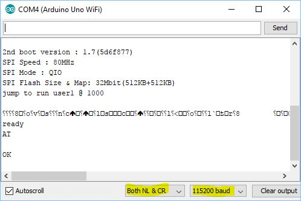

# Uno WiFi (Developer Edition) Serial1

Arduino Uno WiFi is an Arduino UNO R3 with ESP8266 integrated on the board. It was developed and manufactured by Arduino.org.

Uno WiFi Developer Edition connects ATmega328 to ESP8266 using additional on board UART chip SC16IS750 ([here as module](http://sandboxelectronics.com/?product=sc16is750-i2cspi-to-uart-bridge-module)). This additional UART is connected to ATmega as I2C device.

This library creates a Serial1 object with SC16IS750 on Arduino Uno WiFi Developer Edition. This Serial1 enables to communicate with the on-board ESP8266 over it's serial interface. The included tool EspProxy enables accessing the on-board ESP8266 over USB for 'flashing' tools, IDE sketch upload or Serial Monitor.

## Install this library

Download the contents of this GitHub repository as ZIP using the green 'Clone or download' button. Extract the ZIP and copy the folder UnoWiFiDevEdSerial1-master into your Arduino libraries folder (a subfolder in the folder where sketches are saved by IDE). Rename the folder to UnoWiFiDevEdSerial1 (delete -master). Reopen the IDE.

## Uno WiFi with Espressif AT firmware

### Prepare

Download the AT firmware from [Espressif download page](http://espressif.com/en/support/download/at?keys=&field_type_tid%5B%5D=14) and unzip it. Replace the esp_init_data_default.bin with [this one](doc/esp_init_data_UnoWiFi.bin). It has the 40MHz crystal setting. 

1. Open in IDE the EspProxy.ino from UnoWiFiDevEdSerial1 examples tools subfolder.
2. Uncomment the #define FLASHING line (remove the // at the beginning of the line) 
3. Upload the EspProxy sketch into UnoWiFi. (No need to save it.)
4. let the sketch open in IDE

### Option 1 - flashing with esptool.py

Install Python 2.7 and [esptool](https://github.com/espressif/esptool).

Go on command line in the folder with the AT firmware files and run the following command with the COM port of your Uno WiFi:

`esptool.py -p COM-PORT write_flash -ff 80m -fm qio -fs 4MB 0x0 boot_v1.7.bin 0x01000 at/512+512/user1.1024.new.2.bin 0x3fc000 esp_init_data_default.bin 0xfe000 blank.bin 0x3fe000 blank.bin`

### Option 2 - flashing with Espressif Flash Download Tools (Windows)

Download the tool from [Espressif download page](http://espressif.com/en/support/download/other-tools), unzip it and run.

Select files, addresses and settings like on this picture:

Use the Start button to execute.

Note: In field DETECTED INFO the detected frequency will be half of the real frequency. That is why the SpiAutoSet must not be checked.

### Cheking the firmware

1. Return to EspProxy.ino sketch in the IDE
2. Comment the #define FLASHING line (make Undo or put // at the beginning of the line) 
3. Upload the EspProxy sketch into UnoWiFi.

Open the Serial Monitor. EspProxy sketch resets the Esp and you will see the boot log at 115200 baud. The strange characters sequence is normal.

Set the CR/LF setting and send test command 'AT'. The ESP should replay with OK.

Next commands:
* AT+CWMODE=1 sets tha STA mode
* AT+CWJAP="ssid","pass" connects to AP
* AT+CIUPDATE updates the firmware to the latest version
* AT+GMR - prints the version

### Example sketch with WiFiEsp library

Install the [WiFiEsp library](https://github.com/bportaluri/WiFiEsp).

Open the WiFiEspWebClient example. Change the WiFi credentials and upload the sketch.

WiFiEsp library has timeout issues. One of them causes buffer overflow with Uno WiFi Serial1. Instructions are in the sketch.

## Uno WiFi with WiFi Link firmware

WiFi Link firmware is an Arduino esp8266 core sketch. It can by installed by Uploading the source code from IDE, with EspProxy sketch in ATmega. For the Uno WiFi with Serial1 the baud rate in config.h must be changed to baud rate used with Serial1.

To make Uno WiFi ready for WiFi Link flashing:
1. Open in IDE the EspProxy.ino from UnoWiFiDevEdSerial1 examples tools subfolder.
2. Uncomment the #define FLASHING line (remove the // at the beginning of the line) 
3. Upload the EspProxy sketch into UnoWiFi. (No need to save it.)

EspProxy will reset the ESP8266 into bootloader mode always when the Atmega is reset with DTR signal from IDE.

Repository and 
instructions for generic board/module with ESP8266 are [here](https://github.com/jandrassy/arduino-firmware-wifilink).

The version of WiFi Link library modified for use with any serial implementation is [here](https://github.com/jandrassy/arduino-library-wifilink).

The example for Uno WiFi with Serial1 is in examples of the UnoWiFiDevEdSerial1 library.

## Serial1 overflow

Creators of the Uno WiFi did not connect the interrupt pin of the SC16IS750. It is not possible to start receiving from SC16IS750 into Serial1 buffer on interrupt. SC16IS750 has 64 byte RX buffer. If this receive buffer is full SC16IS750 sets the overflow flag and more bytes are not received. The sketch or library then stops waiting for declared count of bytes.

After requesting data from ESP, it is necessary to check for incoming data without delays. It takes time before a http response arrives, but then the data come fast. 

Serial1 objects has overflow() function which checks the overflow flag of SC16IS750. It is useful for debugging overflow situations.

## I2C a.k.a. Wire a.k.a. TWI

Serial1 is an I2C device with address 0x48. Like other devices libraries, it calls twi_init in Serial1.begin() function. With baud rates over 57600, Serial1 sets the I2C 'full speed' (400 kHz). Call Serial1.begin() after initializing other I2C devices.

Serial1 can handle 230400 baud at I2C 'full speed', but only 57600 at I2C 'standard mode' (100 kHz).

